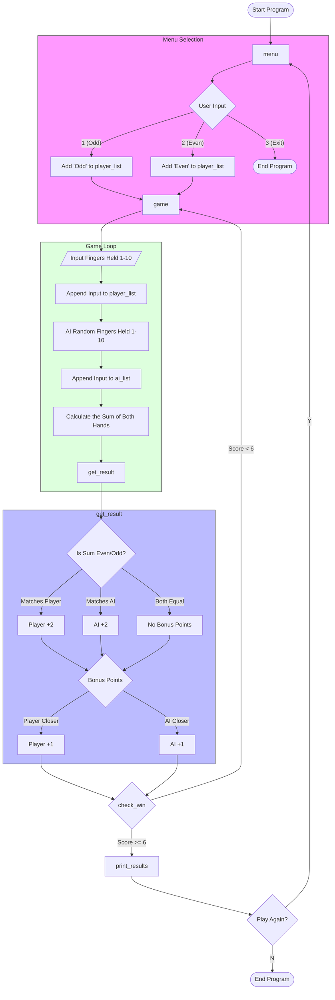
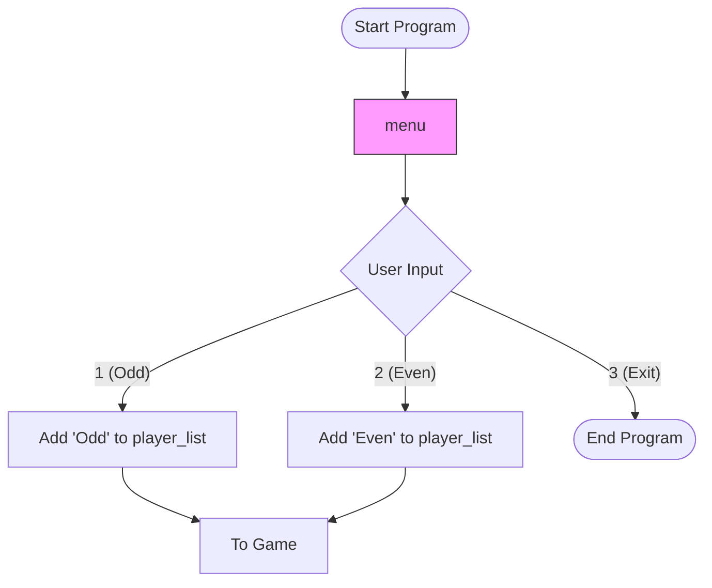

```python

import random

# Variable Declarations
player_list = []
ai_list = []
final_list = []
player_score = 0
ai_score = 0


def menu():
    # Print menu
    print(15 * "-")
    print("Press 1 to play as odd!")
    print("Press 2 to play as even!")
    print("Press 3 to exit the game!")
    print(15 * "-")
    print()

    # Get user input
    x = input("Input number: ")

    # Check if the player wants to play as Odd, Even, or quit the game. If its none prompt the user again
    if x == "1":
        player_list.append("Odd")
        print()
        game()
    elif x == "2":
        player_list.append("Even")
        print()
        game()
    elif x == "3":
        return 0
    else:
        print()
        print("Please input a valid number!")
        print()
        menu()


def game():
    player_hand = 0 # This is here because my LSP was telling me that it might be unbound (its not) so im getting rid of the warning

    # Get how many fingers the player holds up
    i = True
    while i == True:
        player_hand = input("How many fingers do you hold up? ")
        print()
        if player_hand.isnumeric() == True:
            if int(player_hand) in range(1, 11):
                i = False
            else:
             print("Please input a number between 1 and 10!")
             print()
        else:
            print("Please input a number!")
            print()

    # Make player hand an integer
    player_hand = int(player_hand)
    # Add player hand to the list for later display
    player_list.append(player_hand)

    print()
    print(f"You chose {player_hand}!")

    # Calculate ai hand
    ai_hand = random.randint(1, 10)
    # Add ai hand to the list for later display
    ai_list.append(ai_hand)
    print(f"The ai chose {ai_hand}!")

    # Calculate both hands together
    final_hand = player_hand + ai_hand
    # Add final hand to a list for later display
    final_list.append(final_hand)

    print(f"The sum of both hands is {final_hand}!")
    print()

    # Calculate points
    get_result(player_hand, ai_hand, final_hand)

    # Check if anyone won
    check_win()


def get_result(player_hand, ai_hand, final_hand):
    global player_score
    global ai_score

    # Check who won the hand

    # Even
    if final_hand % 2 == 0:  
        if player_list[0] == "Even":
            player_score = player_score + 2

        elif player_list[0] == "Odd":
            ai_score = ai_score + 2

    # Odd
    elif final_hand % 2 == 1:  
        if player_list[0] == "Even":
            ai_score = ai_score + 2

        elif player_list[0] == "Odd":
            player_score = player_score + 2

    # Check who got the extra point
    if (abs(final_hand - player_hand)) > (abs(final_hand - ai_hand)):
        player_score = player_score + 1

    elif (abs(final_hand - player_hand)) < (abs(final_hand - ai_hand)):
        ai_score = ai_score + 1


def check_win():
    # Player wins
    if player_score >= 6:
        print("You win!")
        print_results()

    # Ai wins
    elif ai_score >= 6:
        print("The ai won!")
        print_results()

    # Nobody wins, play another round
    else:
        game()

def print_results():
    global player_list
    global ai_list
    global final_list
    # Get rid of the "Odd" or "Even" at the start of the list
    player_list.pop(0)

    # Title of chart
    print("Round\tPlayer Fingers\tAi Fingers\tFinal Fingers")
    print("-"*53)
    # Print results
    for i in range(len(player_list)):
        print(f"{i}\t{player_list[i]}\t\t{ai_list[i]}\t\t{final_list[i]}")

    replay()

def replay():
    # Ask if they want to play again
    print()
    x = True
    while x == True:
        again = input("Would you like to play again? Y/N: ")
        if again.lower() == "n":
            x = False
            print("Thanks for playing!")
        elif again.lower() == "y":
            x = False
            print("Playing again...")
            print()
            menu()
        else:
            print("Please input Y or N!")

menu()
```





```
```